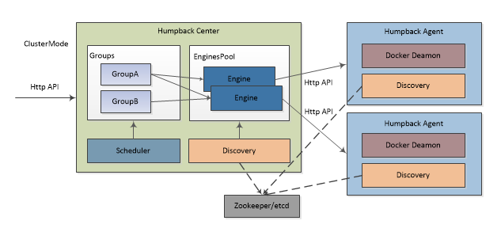
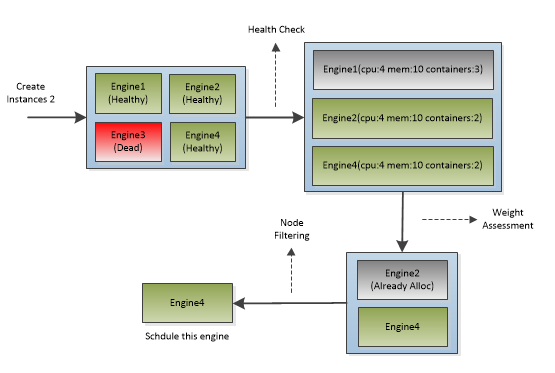

# 集群与调度   



##  集群模式

&ensp;&ensp;&ensp;在使用 Humpback 来管理 Group 时，根据业务需要可选择性将 Group 设置为 `ClusterMode` 模式，一但设置为集群模式后，此时 Group 下的所有服务器节点 Humpback Agnet 会接受 humpback Center 服务管理调度。   

&ensp;&ensp;&ensp;所有被管理的 Humpback Agent 节点都以心跳方式注册到集群中，然后 Humpback Center 再根据节点发现模块发现节点并构建在内部 `EnginesPool` 中进行状态管理，同一个 Humpback Agent 节点可以通过 Humpback 站点同时部署到多个 Group 中。   

&ensp;&ensp;&ensp;Humpback Center 只是一个调度器而本身不运行容器，只会接受 API 请求，通过调度策略选择 Group 中合适的 Engine 来处理本地 Containers。这意味着即使 Humpback Center 由于某些原因出现宕机或关机， 已经运行起来的容器短时间内不会有任何影响。

## 如何启动集群中心服务   

&emsp;Run Humpback Center in docker   
```bash
  $ sudo docker run -d -i -t --net=host \   
       --restart=always \   
       --name=humpback-center \     
       -v /opt/humpback-center/cache/:/opt/humpback-center/cache/ \     
       -v /opt/humpback-center/logs/:/opt/humpback-center/logs/ \     
       -v /opt/humpback-center/etc/config.yaml:/opt/humpback-center/etc/config.yaml \     
       humpback-hub.newegg.org/bts/humpback-center:1.0.0  
```   

## 如何加入到集群

&emsp;Run Humpback Agent in docker：   
```bash
  $ sudo docker run -d -ti --net=host \   
       --restart=always \  
       --name=humpback-agent \   
       -e DOCKER_API_VERSION=v1.20 \   
       -e DOCKER_CLUSTER_ENABLED=true \   
       -e DOCKER_CLUSTER_URIS=zk://192.168.0.1:2181,192.168.0.2:2181,192.168.0.3:2181 \  
       -e DOCKER_CLUSTER_NAME=humpback/center \  
       -v /var/run/:/var/run/:rw \ 
       humpback-hub.newegg.org/bts/humpback-agent:1.0.0
```
&ensp;&ensp;&ensp;相关环境变量   

   - DOCKER_API_VERSION=v1.20，默认 `v1.20`， 使用 `docker version` 命令先查看 Client 中的 API Version。

   - DOCKER_CLUSTER_ENABLED=true，集群模式开关，启动容器后自动会注册到集群中。   

   - DOCKER_CLUSTER_URIS，默认为zookeeper集群地址，若为 etcd 或 consul 等发现工具，请对应将前缀改为 `etcd://` 或 `consul://`。   

   - DOCKER_CLUSTER_NAME=humpback/center，设置humpback集群名称。   

&ensp;&ensp;&ensp;当 Humpback Agent 成功启动后，可在 Humpback 站点修改 Group 属性，打开 ClusterMode 模式选项，此时 Group 下所有服务器将会切换为集群调度模式。

## 如何退出集群     

&ensp;&ensp;&ensp;在 Humpback 站点将 Group 的 ClusterMode 选项关闭，此时 Group 中所有服务将退出集群管理模式，不需要重启 Humpback Agent 容器即可，若要彻底退出集群避免心跳，可以将 Humpback Agent 容器停止后删除重建，重建时将 `DOCKER_CLUSTER_ENABLED` 环境变量设置为false即可。需要注意：一但对出集群，与该 Group 相关所有之前受集群调度的容器将会被统一删除。   

## 调度策略   

&ensp;&ensp;&ensp;目前 ClusterMode 只内置了一种调度策略，策略会根据每台节点的 CPU，Memory 可用量以及 Containers 的数量来给各个节点权重分级，而节点的这些基础信息会在首次启动注册时提交到集群中。      

   

&ensp;&ensp;&ensp;调度容器时，策略按先后顺序分为如下三个阶段：   

- `Health Check`：健康筛选，在调度容器时首先筛选出所有有效节点，原则是在线有效节点。   

- `Weight Assessment`：权重评估，打分候选出可用CPU、内存最多，而容器数量最少的节点。   

- `Node Filtering`：节点过滤，最后根据Filter过滤掉已经分配过或分配过但调度失败的节点。   

&ensp;&ensp;&ensp;如果在经过以上三个阶段裁决后，都还不能分配出效节点（实例数>集群服务器数），调度器会在已经分配过了的节点中随机选择一个节点，在这种情况下往往是以 `--net=host` 主机模式或指定固定 Port 启动的容器会调度失败，此时会进入 Humpback 的报警流程进行邮件通知。   

&ensp;&ensp;&ensp;目前只固化了这一种调度策略算法，目的是尽量将容器分散在集群中，这样做的好处就是如果有节点坏掉不会损失太多的 Container ，同时能起到部分负载均衡的作用。   

## 关于容器   

#### 容器收缩   

&ensp;&ensp;&ensp;关于容器收缩，此情况一般是在修改集群容器实例数时发生，将实例数由大改小时，调度策略会每次选择所有有效节点，比较容器数量最多的节点并倒序排列，最终调度一个本地容器数最多的节点来删除容器，目的也是尽量保持容器分散。

#### 容器迁移   

&ensp;&ensp;&ensp;容器迁移发生在节点宕机或关闭 Humpback Agent 时，目的是按集群容器实例数进行逐步创建恢复，此时调度器会将故障节点上的所有需要被调度的容器进行重新分配，Humpback Center 在检测到节点异常时不会立即触发迁移，而是给出了延时处理（默认为45s），一但超出这个阈值后若节点还未及时恢复上线，此时容器迁移立即触发。这样做的主要目的是为了防止节点抖动导致容器服务间隙中断。

#### 容器恢复   

&ensp;&ensp;&ensp;Humpback Center 启动后会定期默认120s对集群所有 Group 进行一次容器实例数扫描，目的是为了将实例数不足的容器恢复出来，这种情况一般出现在分配失败或直接手动删除docker deamon上的容器实例时发生，容器恢复算法也按照调度策略来进行计算。

## 关于WebHook   

&ensp;&ensp;&ensp;WebHook 功能用于回调通知集群容器实例或状态发生改变，同时可以得知容器被分配的目标宿主机IP地址和名称，在创建 Container 时可以设置多个WebHook，若不设置系统在处理容器后则放弃通知。

&ensp;&ensp;&ensp;WebHook 事件说明：
```
CreateMetaEvent    首次创建 Containers 触发
RemoveMetaEvent    删除 Containers 时触发，包括退出集群模式
OperateMetaEvent   操作 Containers 时触发，Start/Stop/Restart/Kill…
UpdateMetaEvent    修改集群实例数时触发
UpgradeMetaEvent   升级 Containers Tag 时触发
MigrateMetaEvent   系统发生容器迁移时触发
RecoveryMetaEvent  系统恢复或收缩容器时触发
```
&ensp;&ensp;&ensp;WebHook 内容格式：   

&ensp;&ensp;&ensp;如下为容器发生迁移的 WebHook 事件，容器 CLUSTER-dc0d7d79-cluster-test-2 被迁移到了 192.168.0.1 节点上。
```js
{
    "Timestamp": 1491976204448307844,
    "Event": "MigrateMetaEvent",
    "MetaBase": {
        "GroupId": "dc0d7d79-e9a1-46aa-8d47-95335f061b60",
        "MetaId": "0136b582-35ca-4755-8148-b7edde2a1127",
        "Instances": 9,
        "WebHooks": [
            {
                "Url": "http://192.168.0.10:8513/mkkks4r/users",
                "SecretToken": "123456"
            }
        ],
        "ImageTag": "latest",
        "Config": {
            "Id": "",
            "Image": "RegistryServer/base/alpine-bash",
            "Command": "date",
            "Name": "cluster-test",
            "Ports": [],
            "Volumes": [],
            "Dns": null,
            "Env": [],
            "HostName": "",
            "NetworkMode": "host",
            "RestartPolicy": "no",
            "Extrahosts": null,
            "Links": [],
            "Ulimits": null
        }
    },
    "HookContainers": [
        {
            "IP": "192.168.0.1",
            "Name": "SERVER01",
            "Container": {
                "Id": "8af07e8091aa34660e7c53b76083a36dd114250548c7df5670e948e7b15eae05",
                "Image": "RegistryServer/base/alpine-bash",
                "Command": "date",
                "Name": "CLUSTER-dc0d7d79-cluster-test-2",
                "Ports": null,
                "Volumes": null,
                "Dns": null,
                "Env": [],
                "HostName": "SCMISMDTSLR02",
                "NetworkMode": "host",
                "Status": {
                    "Status": "exited",
                    "Running": false,
                    "Paused": false,
                    "Restarting": false,
                    "OOMKilled": false,
                    "Dead": false,
                    "Pid": 0,
                    "ExitCode": 0,
                    "Error": "",
                    "StartedAt": "2017-04-12T03:33:31.216194816Z",
                    "FinishedAt": "2017-04-12T03:33:31.230026534Z"
                },
                "RestartPolicy": "no",
                "Extrahosts": null,
                "Links": null,
                "Ulimits": null
            }
        }
    ]
}
```

- `Timestamp`：WebHook 触发时间戳。
- `Event`：触发事件，参见事件说明。
- `MetaBase`：Meta 代表同一批次的容器，包含多个容器实例，在集群模式中 MetaID 代表唯一批次的容器。
- `GroupID`：容器所属 Group 。
- `MetaID`：容器批次 ID 编号，在集群中是唯一的。若接收到同一 MetaID 的 WebHook，需要判定 Timestamp，取最大的为最新。
- `Instances`：该批次所设定的容器实例数。
- `WebHooks`：配置中设置的所有 WenHook。
- `ImageTag`：该批次容器所使用的镜像 Tag，若同一 Upgrade 后，ImageTag 会改变。
- `Config`：为初次批量创建容器的配置信息。
- `HookContainers`：报告了容器被分配的目标节点信息：IP 和 Name，同时包含了容器信息和状态信息。   