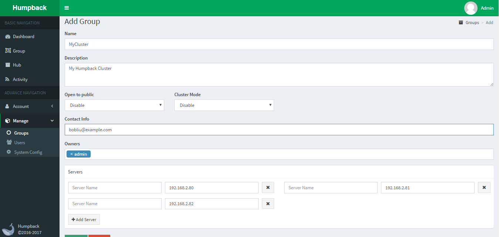
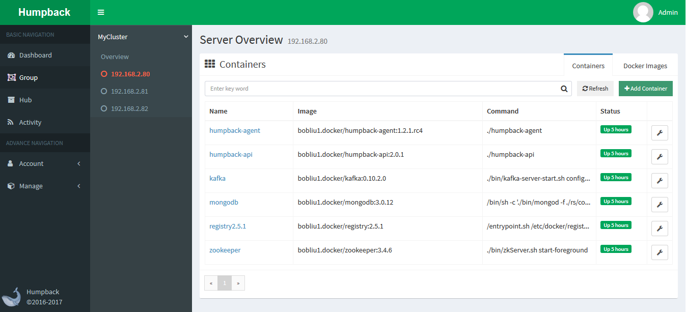

# 如何启动Humpback

> 准备工作   

&ensp;&ensp;&ensp;首先准备好服务器，以三台机器为示例，在开始前请为每台机器安装好 `Docker` 并部署 `Zookeeper` 集群。   

```
SERVER01：192.168.2.80 
SERVER02：192.168.2.81
SERVER03：192.168.2.82 
```

> `Zookeeper` 集群搭建   

- Zookeeper 下载   
  
  示例采用 `Zookeeper 3.4.6` 版本，请确保在服务器上安装了 `java open jdk7` 运行环境，下载 `Zookeeper` 并解压。

```bash
$ cd /opt/app
$ wget http://mirror.bit.edu.cn/apache/zookeeper/zookeeper-3.4.6/zookeeper-3.4.6.tar.gz
$ tar -xzvf zookeeper-3.4.6.tar.gz
$ mv zookeeper-3.4.6 zookeeper
$ cd zookeeper
```
- 修改配置文件   

```bash
$ cp conf/zoo_sample.cfg conf/zoo.cfg
$ vim conf/zoo.cfg
```

- 配置文件修改后如下   

```
tickTime=2000
initLimit=10
syncLimit=5
dataDir=/opt/app/zookeeper/zkdata
dataLogDir=/opt/app/zookeeper/logs
clientPort=2181
server.1=192.168.2.80:2888:3888
server.2=192.168.2.81:2888:3888
server.3=192.168.2.82:2888:3888
```

- 创建数据目录   

```bash
mkdir -p /opt/app/zookeeper/zkdata
mkdir -p /opt/app/zookeeper/logs
```

&ensp;&ensp;&ensp;以上安装流程三台服务器都照执行，接下来开始创建 `zookeeper` 集群并启动。   

- 建立 Zookeeper 节点标识文件 `myid`   

&ensp;&ensp;&ensp;创建 `myid` 编号，依次在每台 Server 上执行，注意每台 Server 的 `myid` 要对应正确的编号。

```bash
192.168.2.80
$ echo "1" > /opt/app/zookeeper/zkdata/myid
```

```bash
192.168.2.81  
$ echo "2" > /opt/app/zookeeper/zkdata/myid
```

```bash
192.168.2.82
$ echo "3" > /opt/app/zookeeper/zkdata/myid
```

- 启动 Zookeeper

```bash
192.168.2.80
$ /opt/app/zookeeper/bin/zkServer.sh start
```

```bash
192.168.2.81  
$ /opt/app/zookeeper/bin/zkServer.sh start
```

```bash
192.168.2.82
$ /opt/app/zookeeper/bin/zkServer.sh start
```

- Zookeeper 状态检查   

```bash
192.168.2.80
$ /opt/app/zookeeper/bin/zkServer.sh status
```
&ensp;&ensp;&ensp;如果 Zookeeper 启动失败或报错，可能有以下几个原因：   

&ensp;&ensp;&ensp;2、`zoo.cfg` 文件配置出错：dataLogDir 指定的目录未被创建。   

&ensp;&ensp;&ensp;3、`myid` 文件中的整数格式不对，或者与 `zoo.cfg` 中的 server 整数不对应。   

&ensp;&ensp;&ensp;4、防火墙未打开 Zookeeper 服务端口，如 `2888` 和 `3888`。   


> 部署 Humpback 私有仓库 Registry

- 拉取 Docker 官方仓库镜像   

&ensp;&ensp;&ensp;以下选用 `192.168.2.80` 作为 Humpback 私有仓库服务器。

```bash
192.168.2.80
$ mkdir -p /var/lib/registry
$ docker pull registry:2.5.1
```

- 启动仓库服务

&ensp;&ensp;&ensp;请将配置文件拷贝到 /etc/docker/registry/config.yml，关于仓库配置说明请参见 <a href="https://github.com/docker/distribution/blob/master/docs/configuration.md">`configuration.md` </a>

&ensp;&ensp;&ensp;仓库若要支持跨域访问，请将 `config.yml` 中 `http` 项改为如下：   

```bash
http:
  addr: :5000
  secret: abcdfg
  headers:
    X-Content-Type-Options: [nosniff]
    Access-Control-Allow-Headers: ['Origin,Accept,Content-Type,Authorization']
    Access-Control-Allow-Origin: ['*']
    Access-Control-Allow-Methods: ['GET,POST,PUT,DELETE']
```
&ensp;&ensp;&ensp;启动仓库   

```bash
$ docker run -d -p 5000:5000 --restart=always \
> -v /var/lib/registry/:/var/lib/registry/ \
> -v /etc/docker/registry/config.yml:/etc/docker/registry/config.yml \
> --name registry \
  registry:2.5.1
```
- 检查启动状态，若 `_catalog` 接口能正常访问，证明仓库启动成功。    

```bash
$ docker ps -a
CONTAINER ID    IMAGE            COMMAND                  CREATED         STATUS            PORTS                    NAMES
a0e4c87eef5b    registry:2.5.1   "/entrypoint.sh /etc/"   15 minutes ago  45 seconds ago    0.0.0.0:5000->5000/tcp   registry
$ curl http://192.168.2.80:5000/v2/_catalog
{"repositories":[]}
``` 

> 部署 Humpback Web 站点   

&ensp;&ensp;&ensp;以 192.168.2.80 作为 Humpback Web 站点服务器启动

```bash
$ ssh root@192.168.2.80
$ mkdir -p /opt/app/humpback-web
$ docker run -d --net=host --restart=always \
> -v /opt/app/humpback-web/dbFiles:/humpback-web/dbFiles \
> --name humpback-web \
> humpback/humpback-web:1.0.0
```
&ensp;&ensp;&ensp;站点默认访问端口为：80，如果要自定义端口，请在容器创建时指定 `-e HUMPBACK_LISTEN_PORT=XXXX` 即可。   

&ensp;&ensp;&ensp;`dbFiles` 文件为 Humpback 系统持久化数据文件，会存储站点管理和分组信息，启动后请妥善保存。

&ensp;&ensp;&ensp;访问站点，打开浏览器输入：http://192.168.2.80    

&ensp;&ensp;&ensp;默认账户：admin  密码：123456   


&ensp;&ensp;&ensp;以管理员身份登录 Humpback Web 站点，展开左侧 `Manage` 功能点击 `System Config`，进入系统配置界面，将 `Enabel Private Registry` 勾选，并填入先前部署的私有仓库服务地址 `http://192.168.2.80:5000` Save 即可。 


> 部署 Humpback Agent 

&ensp;&ensp;&ensp; 三台服务器：192.168.2.80, 192.168.2.81, 192.168.2.82 都需要部署 Humpback Agent 用于实现本地镜像、容器管理。

- 检查 Docker 版本

&ensp;&ensp;&ensp; 首先检查 `Docker API` 版本号：`1.21`，注意不同 Docker 版本，版本号有所区别。

```bash
$ docker version
Client:
 Version:      1.9.1
 API version:  1.21
 Go version:   go1.4.3
 Git commit:   a34a1d5
 Built:        Fri Nov 20 17:56:04 UTC 2015
 OS/Arch:      linux/amd64

Server:
 Version:      1.9.1
 API version:  1.21
 Go version:   go1.4.3
 Git commit:   a34a1d5
 Built:        Fri Nov 20 17:56:04 UTC 2015
 OS/Arch:      linux/amd64
```

- 启动 Humpback Agent

&ensp;&ensp;&ensp; `DOCKER_API_VERSION=v1.21` 一定要与上面的版本号对应一致。   

&ensp;&ensp;&ensp; `DOCKER_CLUSTER_ENABLED=true` 如果当前 Agent 需要被集群模式调度 `Cluster Mode` 模式，请设置为 `true`，否则关闭集群调度该节点为 `Single Mode` 模式。   

&ensp;&ensp;&ensp; `DOCKER_CLUSTER_URIS=zk://192.168.2.80:2181,192.168.2.81:2181,192.168.2.82:2181` 为先前配置的 `Zookeeper` 集群地址信息。

```bash 
$ docker pull humpback/humpback-agent:1.0.0
$ docker run -d -ti --net=host --restart=always \
> --name=humpback-agent \
> -e DOCKER_API_VERSION=v1.21 \
> -e DOCKER_CLUSTER_ENABLED=true \
> -e DOCKER_CLUSTER_URIS=zk://192.168.2.80:2181,192.168.2.81:2181,192.168.2.82:2181 \
> -e DOCKER_CLUSTER_NAME=humpback/center \
> -v /var/run/:/var/run/:rw \
> humpback/humpback-agent:1.0.0
$ docker ps -a
CONTAINER ID    IMAGE                           COMMAND                  CREATED        STATUS         PORTS         NAMES
b1ac4a82c2dd    humpback/humpback-agent:1.0.0   "/usr/bin/dumb-init -"   3 minutes ago  20 seconds ago               humpback-agent
```

- 创建分组，注册服务器

&ensp;&ensp;&ensp;三台服务器都成功启动 `Humpback Agent` 容器后，进入 `Humpback Web` 站点，展开左侧 `Manage` 功能点击 `Groups` 创建一个分组：`MyCluster`   

&ensp;&ensp;&ensp;并将三台节点服务器加入到该组中并点击 `Save` 即可。



&ensp;&ensp;&ensp;进入分组页面，可以查看三台集群服务器信息。



- [如何创建容器](single-create-container.md)

- [如何管理容器](single-manage-container.md)

- [批量操作](single-batch-operate.md)

> 启动 Humpback Center   

&ensp;&ensp;&ensp;Humpback Center 主要为 Humpback 平台提供集群容器调度服务，以集群中心角色实现各个 Group 的容器分配管理。   

&ensp;&ensp;&ensp;需要集群调度的 `Group` 要在设置中将 `Cluster Mode` 开关打开即可。

- 启动 Humpback Center

&ensp;&ensp;&ensp; `CENTER_LISTEN_PORT=:8589` Humpback Center 的 API 默认端口为：8589。   

&ensp;&ensp;&ensp; `DOCKER_CLUSTER_URIS=zk://192.168.2.80:2181,192.168.2.81:2181,192.168.2.82:2181` 为先前配置的 `Zookeeper` 集群地址信息。

```bash 
$ docker pull humpback/humpback-center:1.0.0
$ docker run -d -ti --net=host --restart=always \
> --name=humpback-center \
> -e CENTER_LISTEN_PORT=:8589
> -e DOCKER_CLUSTER_URIS=zk://192.168.2.80:2181,192.168.2.81:2181,192.168.2.82:2181 \
> -e DOCKER_CLUSTER_NAME=humpback/center \
> -e /opt/app/humpback-center/cache:/opt/humpback-center/cache \
> -e /opt/app/humpback-center/logs:/opt/humpback-center/logs \
> -v /var/run/:/var/run/:rw \
> humpback/humpback-center:1.0.0
$ docker ps -a
CONTAINER ID    IMAGE                           COMMAND                  CREATED        STATUS         PORTS         NAMES
a1640bf8c956    humpback/humpback-center:1.0.0  "/usr/bin/dumb-init -"   15 minutes ago  45 seconds ago              humpback-center
```

- [集群模式如何创建容器](cluster-create-container.md)

- [集群调度策略](cluster-container-schedule)
